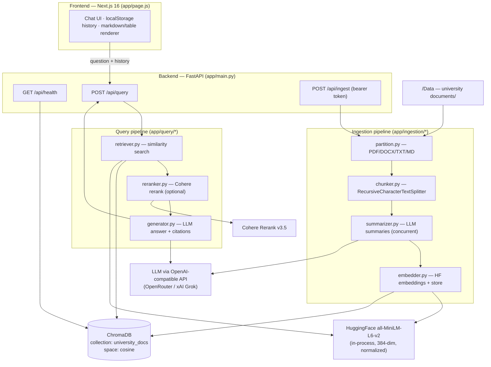
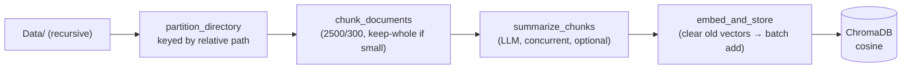
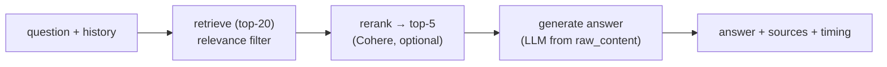

# UniAssist — Architecture & Current State

> **Scope:** This document describes the **currently implemented** system (post-refactor).
> For the original, more ambitious design vision (S3, Supabase, Clerk, Celery, Unstructured.io,
> BGE-M3 microservice, LangGraph routing), see [`uniassist.md`](./uniassist.md). Several items
> in that document are **roadmap / not yet built** — the "Gap vs. design doc" section below
> reconciles the two.
>
> **Evaluation program:** for the ongoing evaluation/benchmarking effort, see the Phase 0 audit
> [`docs/CURRENT_STATE.md`](./docs/CURRENT_STATE.md) and the frozen reference configuration
> [`docs/BASELINE_V1.md`](./docs/BASELINE_V1.md).

---

## 1. Overview

UniAssist (branded **LPUAssist** in the UI) is a **Retrieval-Augmented Generation (RAG)**
assistant that answers questions about Lovely Professional University policies — dress code,
placements, library rules, academic benefits, residential facilities, semester exchange, NSS,
and the campus map — grounded strictly in official university documents.

It has two independently deployable parts:

- **Backend** — a FastAPI service that runs an offline **ingestion pipeline** (documents → chunks
  → summaries → embeddings → vector store) and an online **query pipeline**
  (retrieve → rerank → generate).
- **Frontend** — a Next.js App Router single-page chat UI (ChatGPT-style).

---

## 2. System architecture



**Request flow (query):** `question + prior turns` → embed query → ChromaDB similarity search
(top‑K) → Cohere rerank to top‑N (skipped if no key) → LLM generation from **raw** chunk text →
answer + source citations + per-step timings.

---

## 3. Tech stack

### Backend (Python)
| Concern | Technology |
|---|---|
| Web framework | **FastAPI** (`>=0.115`), **Uvicorn** (`[standard]`) |
| Config | **pydantic-settings** (`.env`-driven), python-dotenv |
| Orchestration | **LangChain** (core / community / text-splitters) |
| PDF parsing | **pdfplumber** (table-aware, primary), **pypdf** (fallback) |
| DOCX parsing | **python-docx** |
| TXT / MD parsing | LangChain `TextLoader` (UTF-8) |
| Embeddings | **langchain-huggingface** + **sentence-transformers** |
| Vector store | **ChromaDB** + **langchain-chroma** |
| LLM client | **langchain-openai** (`ChatOpenAI`, OpenAI-compatible) |
| Reranker | **langchain-cohere** (`CohereRerank`) |
| Logging / CLI | **rich** |

### Frontend (JavaScript)
| Concern | Technology |
|---|---|
| Framework | **Next.js 16.3.1** (App Router, Turbopack) |
| UI library | **React 19.2.8** / react-dom |
| Language | JavaScript (JSX), no TypeScript |
| Styling | CSS Modules + global CSS variables (dark theme, LPU orange) |
| Fonts | Inter + JetBrains Mono (Google Fonts via CSS `@import`) |
| Linting | ESLint 9 + eslint-config-next |
| State/persistence | React hooks + `localStorage` (no external state lib) |

### Infrastructure
| Concern | Technology |
|---|---|
| Vector DB (containerized) | `chromadb/chroma:latest` via **docker-compose** (host `8001` → container `8000`) |
| Vector DB (hosted) | ChromaDB on **Render** (client-server mode over HTTPS) |
| Backend runtime | Python 3 virtualenv (`backend/venv`) |

---

## 4. Models & external APIs

| Role | Model / Service | Where | Configured via |
|---|---|---|---|
| **Text embeddings** | `all-MiniLM-L6-v2` (384-dim, normalized, cosine) | In-process (CPU, auto-CUDA) | `EMBEDDING_MODEL` |
| **LLM (summarize + generate)** | OpenAI-compatible chat model | External API | `LLM_API_KEY` / `LLM_BASE_URL` / `LLM_MODEL` (legacy `GROK_*` accepted) |
| **Reranker** | `rerank-v3.5` (cross-encoder) | Cohere API | `COHERE_API_KEY` / `COHERE_RERANK_MODEL` |
| **Vector store** | ChromaDB (`university_docs`) | Local file **or** remote HTTP | `CHROMA_*` |

### Currently configured deployment (from `backend/.env`)
- **LLM provider:** OpenRouter (`LLM_BASE_URL=https://openrouter.ai/api/v1`), **model `google/gemini-2.5-flash`**.
  *(Code defaults, if unset, are xAI Grok: `https://api.x.ai/v1`, `grok-3-mini`.)*
- **Reranker:** **configured and active** — `COHERE_API_KEY` is set, so Cohere `rerank-v3.5`
  reranks the top‑K candidates down to top‑N (`RERANK_TOP_N`).
- **Vector store:** **client-server mode** against `uniassist-chroma.onrender.com:443` (SSL),
  collection `university_docs`.
- **Embeddings:** loaded in-process on CPU.

> Both the LLM and Cohere are **optional at runtime**: without an LLM key the backend returns a
> structured extract of retrieved passages; without a Cohere key it skips reranking. This lets you
> test retrieval end-to-end with no paid keys.

### Model / retrieval parameters
| Parameter | Value | Location |
|---|---|---|
| Chunk size / overlap | `2500` / `300` chars | `chunker.py` |
| Text splitter | `RecursiveCharacterTextSplitter` (`\n\n`, `\n`, `. `, ` `, ``) | `chunker.py` |
| Retrieval top‑K | `20` | `RETRIEVAL_TOP_K` |
| Rerank top‑N | `5` | `RERANK_TOP_N` |
| Min relevance score | `0.0` (disabled) | `RETRIEVAL_MIN_SCORE` |
| Summarization temp / max tokens | `0.0` / `256` | `summarizer.py` |
| Generation temp / max tokens | `0.1` / `1024` | `generator.py` |
| Summarization concurrency | `5` | `SUMMARY_CONCURRENCY` |

---

## 5. Repository layout

```
uniassist/
├── backend/
│   ├── app/
│   │   ├── config.py             # pydantic-settings (env-driven)
│   │   ├── main.py               # FastAPI app, endpoints, auth, rate limit
│   │   ├── ingestion/
│   │   │   ├── partition.py      # PDF/DOCX/TXT/MD → LangChain Documents
│   │   │   ├── chunker.py        # split into retrieval-friendly chunks
│   │   │   ├── summarizer.py     # LLM summaries (concurrent) → searchable content
│   │   │   ├── embedder.py       # HF embeddings + Chroma store + health check
│   │   │   └── pipeline.py       # CLI orchestrator (steps 3–6)
│   │   └── query/
│   │       ├── retriever.py      # embed query + similarity search
│   │       ├── reranker.py       # Cohere cross-encoder (optional)
│   │       ├── generator.py      # LLM answer + citations + history
│   │       └── chain.py          # query() orchestration (steps 7–9)
│   ├── requirements.txt
│   └── .env.example
├── frontend/
│   ├── app/
│   │   ├── page.js               # entire chat UI + markdown formatter
│   │   ├── layout.js             # root layout + metadata
│   │   ├── globals.css           # design tokens + keyframes
│   │   └── page.module.css       # component styles
│   ├── package.json
│   └── .env.example
├── Data/                         # university documents (see §8)
├── docker-compose.yml            # ChromaDB container
├── README.md                     # quickstart
├── uniassist.md                  # original design/roadmap doc
└── ARCHITECTURE.md               # this file
```

---

## 6. Backend deep dive

### 6.1 Ingestion pipeline (offline — `python -m app.ingestion.pipeline`)



1. **Partition** (`partition.py`) — walks `Data/` recursively for `.pdf`, `.docx`, `.txt`, `.md`.
   PDFs are parsed **table-aware** with `pdfplumber` (tables → Markdown), falling back to
   `PyPDFLoader`. Each file is keyed by its **path relative to `Data/`** (prevents same-name files
   in different folders from colliding). Images (e.g. `.jpg`) are **not** ingested.
2. **Chunk** (`chunker.py`) — documents under 2500 chars are kept whole; larger ones are split with
   `RecursiveCharacterTextSplitter`. Metadata is enriched (`source_file`, `chunk_index`,
   `chunk_type` = `table`/`text_only`, `page_number`).
3. **Summarize** (`summarizer.py`) — if an LLM key is set, each chunk is summarized **concurrently**
   (`chain.batch`, bounded by `SUMMARY_CONCURRENCY`); the summary becomes the **searchable**
   `page_content` and the original text is preserved in `metadata.raw_content`. Failures fall back
   to raw text. Without a key, raw text is used directly.
4. **Embed & store** (`embedder.py`) — sanitizes metadata to Chroma-safe primitives, **deletes any
   existing vectors for the same sources** (idempotent re-ingest, no orphans), then adds documents
   in batches of 50 with deterministic IDs `"{source_file}__chunk_{index}"`.

### 6.2 Query pipeline (online — `app/query/chain.py::query`)



1. **Retrieve** (`retriever.py`) — `similarity_search_with_relevance_scores` (cosine) for top‑K;
   candidates below `RETRIEVAL_MIN_SCORE` are dropped; relevance score attached to metadata.
2. **Rerank** (`reranker.py`) — Cohere cross-encoder narrows to top‑N. Skipped (with a warning) if
   no key; errors fall back to retrieval order.
3. **Generate** (`generator.py`) — builds context from each doc's **`raw_content`**, injects up to
   `MAX_HISTORY_MESSAGES` (6) prior turns, and calls the LLM with a citation-focused, table-aware
   system prompt. Leaked `<think>…</think>` reasoning blocks are stripped. Without an LLM key, a
   structured extract of the passages is returned instead.

### 6.3 API endpoints (`app/main.py`)

| Method | Path | Auth | Purpose |
|---|---|---|---|
| `GET` | `/api/health` | none | Config + **live ChromaDB connectivity** + indexed doc count |
| `POST` | `/api/query` | optional rate limit | Ask a question (with optional history) |
| `POST` | `/api/ingest` | **Bearer `INGEST_TOKEN`** | Trigger ingestion (disabled unless token set) |

Interactive docs are available at `/docs` (Swagger) and `/redoc`.

**`POST /api/query` — request**
```json
{
  "question": "What is the dress code policy?",
  "history": [
    { "role": "user", "content": "..." },
    { "role": "assistant", "content": "..." }
  ]
}
```
*(`question`: 3–1000 chars; `history`: up to 20 turns, optional.)*

**`POST /api/query` — response**
```json
{
  "answer": "…",
  "sources": ["DressCode/Dress Code and Uniform Policy for Students.pdf"],
  "has_llm": true,
  "timing": { "retrieval": 0.12, "reranking": 0.0, "generation": 1.83, "total": 1.95 },
  "candidates_retrieved": 20,
  "candidates_reranked": 5
}
```

**`GET /api/health` — response**
```json
{
  "status": "ok",
  "llm_configured": true,
  "cohere_configured": true,
  "embedding_model": "all-MiniLM-L6-v2",
  "collection": "university_docs",
  "chroma_mode": "client_server",
  "chroma_host": "https://uniassist-chroma.onrender.com:443",
  "chroma_connected": true,
  "documents_indexed": 128
}
```

---

## 7. Frontend architecture

A single client component (`app/page.js`) implements the whole experience:

- **Chat state** — `messages`, `chatSessions`, `activeChatId`, `input`, `isLoading` via React hooks.
- **Persistence** — conversations saved to `localStorage` (`lpuassist_chats`), capped at
  `MAX_SESSIONS = 50`; sidebar lists recent chats with load/delete.
- **Networking** — `fetch(NEXT_PUBLIC_API_BASE + "/api/query")`, sends up to the last 8 non-error
  turns as `history`; uses `AbortController` to cancel superseded/unmounted requests.
- **Markdown rendering** (`FormattedText`) — block parser for headings (`**…**`), grouped bullet
  lists (`<ul><li>`), **Markdown tables** (`| … |`), inline bold, horizontal rules, and italic
  notes; strips leaked `<think>` blocks as a safety net.
- **UX** — suggestion chips, typing indicator, source badges (basename), retry-on-error button,
  auto-growing textarea, collision-free message IDs (`crypto.randomUUID`).
- **Config** — `NEXT_PUBLIC_API_BASE` (defaults to `http://localhost:8000`).

---

## 8. Data corpus (`Data/`)

| Folder | Files |
|---|---|
| `DressCode` | Dress Code and Uniform Policy for Students.pdf · FAQ's.pdf |
| `EDU REV` | Academic Benefits.pdf |
| `LibraryPolicy` | Library Policy.pdf |
| `NSSPolicy` | LPUNSSPOLICY.pdf |
| `PlacementPloicy` | 2023 Career Services Policy.pdf · Academic Benefit Plan – 3rd Party Industry Tests (DOCX) · Academic Benefit Plan – Clearing Competitive Exams.pdf · Academic Benefit Plan – Placement and Internship.pdf · OJT Internship policy.pdf |
| `ResidentialFacilities` | Charges For Residential Facilities.pdf · Residential Facilities Refund Guidelines.pdf |
| `SemesterExchange` | Semester_Year_Abroad_Policy.pdf |
| `UNImap` | UNIMAP.jpg *(not ingested)* · UNIMAP_Campus_Guide.txt |

Formats present: **PDF, DOCX, TXT, JPG**. Only PDF/DOCX/TXT/MD are ingested; the map image relies on
its `.txt` companion for searchable content.

---

## 9. Configuration reference

### Backend (`backend/.env`)
| Variable | Default | Purpose |
|---|---|---|
| `ALLOWED_ORIGINS` | `http://localhost:3000,http://127.0.0.1:3000` | CORS allowlist (comma-separated) |
| `INGEST_TOKEN` | *(empty)* | Bearer token for `/api/ingest`; empty **disables** HTTP ingest |
| `RATE_LIMIT_PER_MINUTE` | `0` | Per-IP throttle for `/api/query` (0 = off) |
| `LLM_API_KEY` | *(empty)* | LLM key *(legacy `GROK_API_KEY` accepted)* |
| `LLM_BASE_URL` | `https://api.x.ai/v1` | OpenAI-compatible base URL *(legacy `GROK_BASE_URL`)* |
| `LLM_MODEL` | `grok-3-mini` | Chat model *(legacy `GROK_MODEL`)* |
| `COHERE_API_KEY` | *(empty)* | Enables reranking |
| `COHERE_RERANK_MODEL` | `rerank-v3.5` | Cohere rerank model |
| `CHROMA_HOST` | *(empty)* | Empty = local file mode; set = client-server mode |
| `CHROMA_PORT` | `8001` | Chroma server port |
| `CHROMA_SSL` | `false` | Use HTTPS to Chroma |
| `CHROMA_AUTH_TOKEN` | *(empty)* | Optional `X-Chroma-Token` header |
| `CHROMA_COLLECTION` | `university_docs` | Collection name |
| `EMBEDDING_MODEL` | `all-MiniLM-L6-v2` | HF sentence-transformer |
| `SUMMARY_CONCURRENCY` | `5` | Max concurrent summarization calls |
| `RETRIEVAL_TOP_K` | `20` | Candidate set size |
| `RERANK_TOP_N` | `5` | Post-rerank set size |
| `RETRIEVAL_MIN_SCORE` | `0.0` | Drop candidates below this cosine score |

### Frontend (`frontend/.env.local`)
| Variable | Default | Purpose |
|---|---|---|
| `NEXT_PUBLIC_API_BASE` | `http://localhost:8000` | Backend base URL |

---

## 10. Deployment

- **ChromaDB (container):** `docker compose up -d` starts `chromadb/chroma:latest`, persisting to
  `backend/chroma_db`, exposed on host port **8001**. Point the backend at it with
  `CHROMA_HOST=localhost`, `CHROMA_PORT=8001`.
- **ChromaDB (hosted):** the current `.env` targets a **Render**-hosted Chroma over HTTPS (port 443).
- **Backend:** `uvicorn app.main:app --port 8000`. Ingestion is run once via the CLI
  (`python -m app.ingestion.pipeline`) or via the token-protected `/api/ingest`.
- **Frontend:** `npm run build` / `npm run start` (or deploy to Vercel); set `NEXT_PUBLIC_API_BASE`
  and add the frontend origin to the backend `ALLOWED_ORIGINS`.

---

## 11. Security posture

- Secrets live only in `backend/.env` (git-ignored; never committed).
- CORS is an explicit env-driven allowlist.
- `/api/ingest` requires a bearer token and is disabled by default.
- Error responses are generic; details are logged server-side only.
- Optional per-IP rate limiting on `/api/query` (in-memory, per process).

> **Operational note:** rotate any LLM/Cohere keys that have been shared, and prefer a platform
> secrets manager in production. The in-memory rate limiter is best-effort per worker — use a shared
> store (e.g. Redis) for multi-worker deployments.

---

## 12. Gap vs. the design doc (`uniassist.md`)

The original design describes a larger system. What is **actually built today**:

| Design doc proposes | Current implementation |
|---|---|
| Amazon S3 for raw files | ❌ Not used — files read from local `Data/` |
| Supabase (PostgreSQL) metadata | ❌ Not used — no relational DB |
| Clerk authentication | ❌ Not used — no user auth |
| Redis + Celery async processing | ❌ Not used — ingestion is a synchronous CLI/endpoint |
| Unstructured.io partitioning | ➖ Replaced by `pdfplumber` / `pypdf` / `python-docx` / `TextLoader` |
| BGE-M3 embeddings (microservice) | ➖ `all-MiniLM-L6-v2`, in-process |
| Grok for summarize/generate | ✅ Configurable LLM (currently OpenRouter `gemini-2.5-flash`) |
| ChromaDB vector store | ✅ Implemented (local or Render client-server) |
| Cohere Rerank v3.5 | ✅ Implemented **and active** (keyed in current `.env`) |
| LangChain orchestration | ✅ Implemented |
| LangGraph adaptive routing | ❌ Not built (roadmap) |
| Hybrid search / metadata filtering | ❌ Not built (roadmap) |
| Multi-turn conversation | ✅ Implemented (frontend history → generator prompt) |

**Not yet implemented (roadmap):** file upload + auth, async ingestion queue, image/OCR ingestion,
query routing/reformulation, hybrid (dense+sparse) search, metadata-scoped retrieval, evaluation
and tracing pipelines.

---

## 13. Quickstart

See [`README.md`](./README.md) for full setup. In short:

```bash
# Backend
cd backend && python -m venv venv
source venv/bin/activate          # or .\venv\Scripts\Activate.ps1 on Windows
pip install -r requirements.txt
cp .env.example .env              # set LLM_API_KEY, CHROMA_*, etc.
python -m app.ingestion.pipeline  # build the index
uvicorn app.main:app --reload --port 8000

# Frontend
cd frontend && npm install
cp .env.example .env.local        # optional: set NEXT_PUBLIC_API_BASE
npm run dev                       # http://localhost:3000
```
